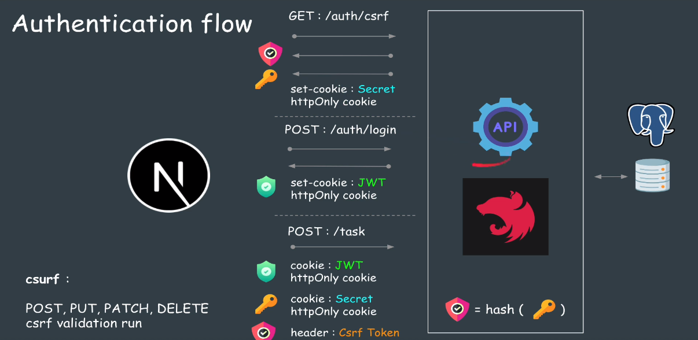

## AuthFlow

1. Get:/auth/csrf(リクエスト)
2. set-cookie: Secret httpOnly cookie (レスポンス)
3. Post :/auth/login (リクエスト)
4. set-cookie: JWT httpOnly cookie (レスポンス)



---

開発中

```ts
secure: false;
```

本番環境

```ts
secure: true;
```
